# 로그인 경보 자동화 봇

파이썬이 만든 보안 경보를 n8n이 받아 **레벨에 따라 허용/거부를 판정**하고, 판정에 따라 서로 다른 문구를 만들어 **슬랙·디스코드·텔레그램 3곳**에 알린 뒤, 게시판 서버의 **REST API를 호출해 MySQL에 기록**하는 자동화 파이프라인입니다.

```
[내 PC · 파이썬]              [내 Docker · n8n]            [내 Docker · MySQL]
alert_sender.py  ──POST──▶  Webhook
                              └ Code 노드 (심각도·허용/거부 판정)
                                 └ IF 노드 (decision 이 deny 인가?)
                                    ├ 🚫 거부 문구 ─┐
                                    └ ✅ 허용 문구 ─┴─▶ 슬랙 · 디스코드 · 텔레그램
                                                     └─▶ 게시판 REST ──▶ security_events
```

---

## 1. 작업 내역

### 만든 순서

1. **파이썬 전송기** — 경보 2건(레벨 10 = 거부 대상, 레벨 3 = 허용 대상)을 JSON으로 만들어 n8n Webhook에 POST
2. **n8n Code 노드** — 경보 1건을 아이템 1개로 펼치고 레벨에 따라 `severity` · `decision` · `reason` 부여
3. **IF 노드 + 문구 노드 2개** — `decision`이 `deny`인지로 두 갈래를 나누고 각각 다른 문구 생성
4. **메신저 3곳 연결** — 두 갈래 모두 슬랙·디스코드·텔레그램으로 발송
5. **게시판 REST 연동** — n8n 마지막 노드가 게시판 API를 호출해 허용·거부 모두 MySQL에 저장

### 사용한 것

| 구분 | 내용 |
|---|---|
| 언어 | Python 3.13 (전송기), JavaScript (n8n Code 노드) |
| 자동화 | n8n (Docker) — Webhook · Code · IF · Set · HTTP Request |
| 게시판 | Flask (앱 팩토리 구조) + SQLAlchemy |
| DB | MySQL 8.0 (Docker), 테이블 `security_events` |
| 메신저 | 슬랙 Incoming Webhook · 디스코드 웹후크 · 텔레그램 봇 API |

### 판정 규칙

| 조건 | severity | decision |
|---|---|---|
| level ≥ 10 | High | deny |
| level ≥ 7 | Medium | allow |
| 그 외 | Low | allow |

거부 기준은 코드 맨 위 상수 `DENY_LEVEL`로 분리해, 숫자만 바꿔도 판정이 달라지도록 했습니다.

---

## 2. 기능 구현 화면

### 워크플로 전체

Webhook → Code(판정) → IF(분기) → 문구 2종 → 메신저 3곳 + 게시판 저장. 모든 노드 성공.

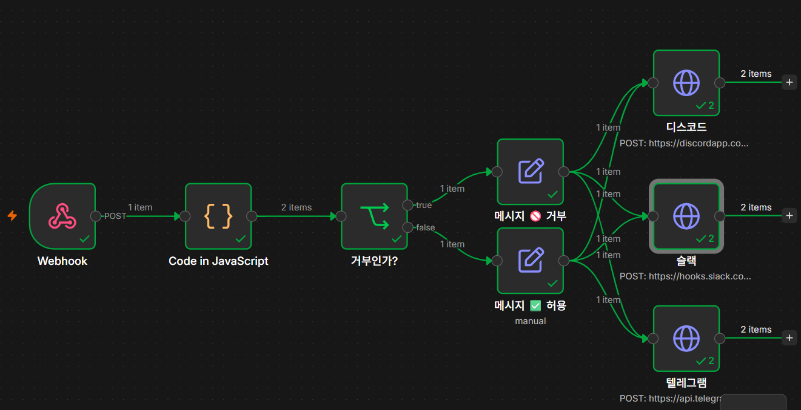

### 파이썬 전송기와 전송 성공

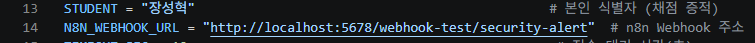

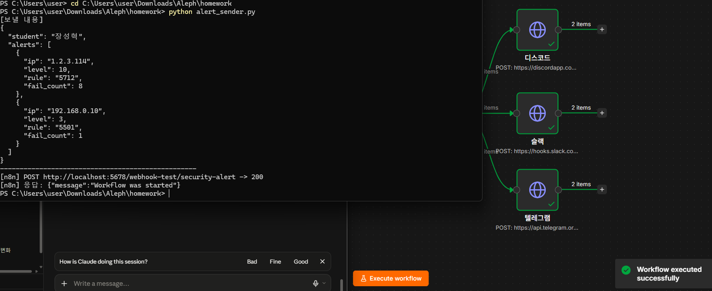

전송에 실패해도 프로그램이 죽지 않고 오류 메시지만 출력합니다.

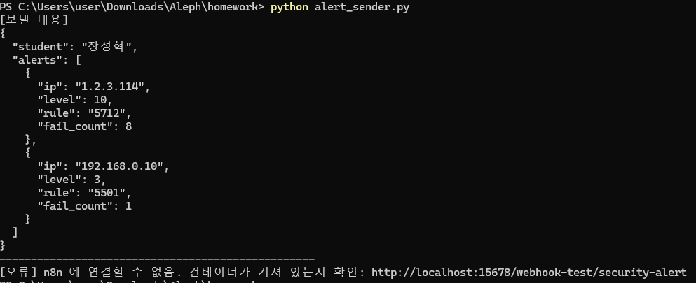

### 판정 (경보 2건 → 아이템 2개)

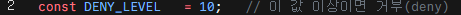

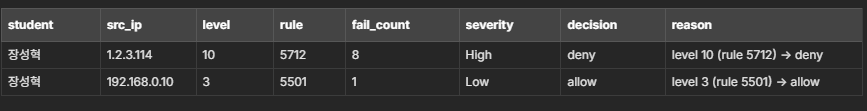

거부 기준 상수를 10에서 3으로 바꾸면 레벨 3 경보도 거부로 바뀝니다.

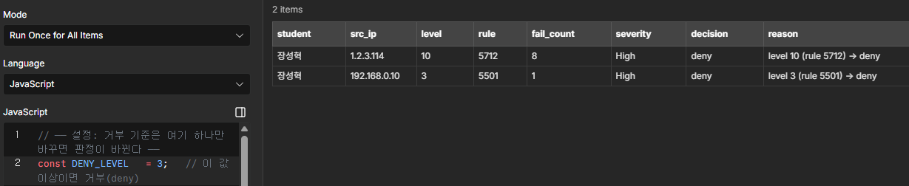

### 분기와 문구

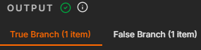

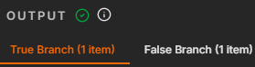

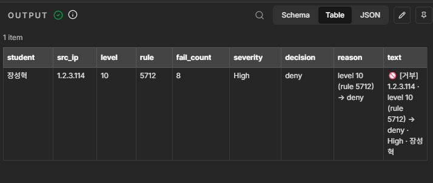

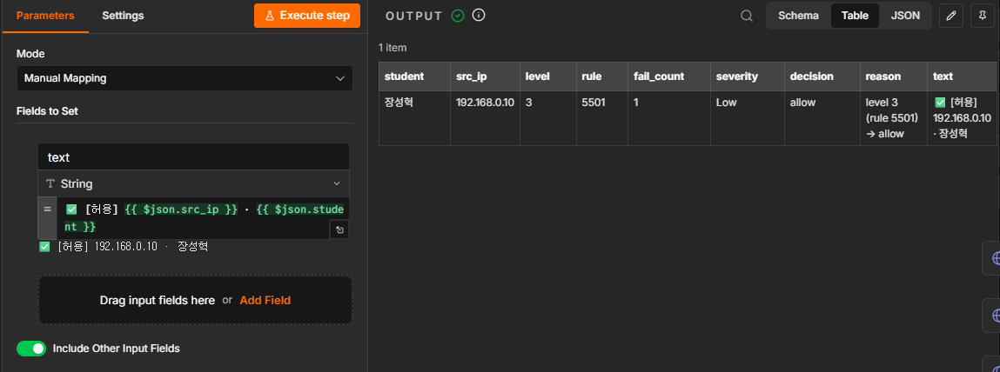

### 메신저 도착 화면

거부 1건 + 허용 1건이 각 메신저에 도착합니다.

**슬랙**

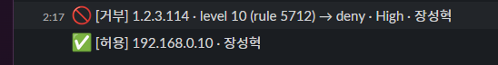

**디스코드**

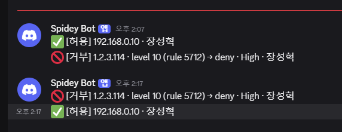

**텔레그램**

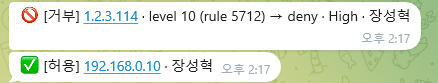

### 게시판 REST API와 데이터베이스

`security_events` 테이블 구조

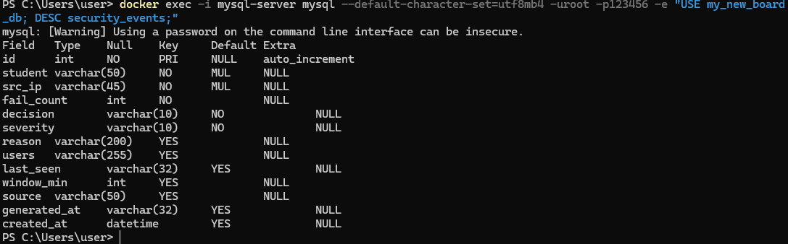

인증 없음 401 · 잘못된 키 401 · 필수값 누락 400 · 정상 201

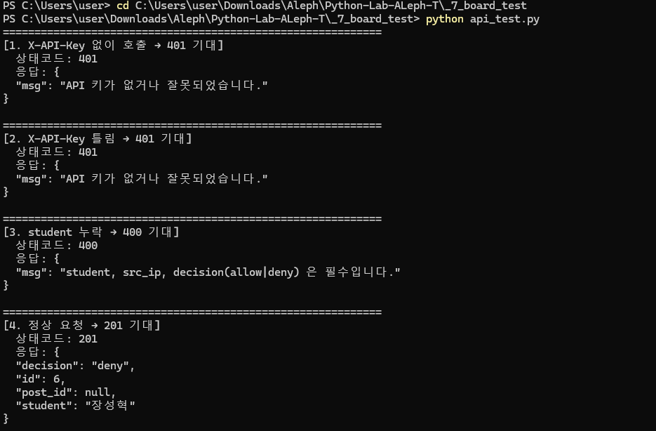

`GET /api/security/events?student=<이름>` — 본인 기록만 최신순 조회

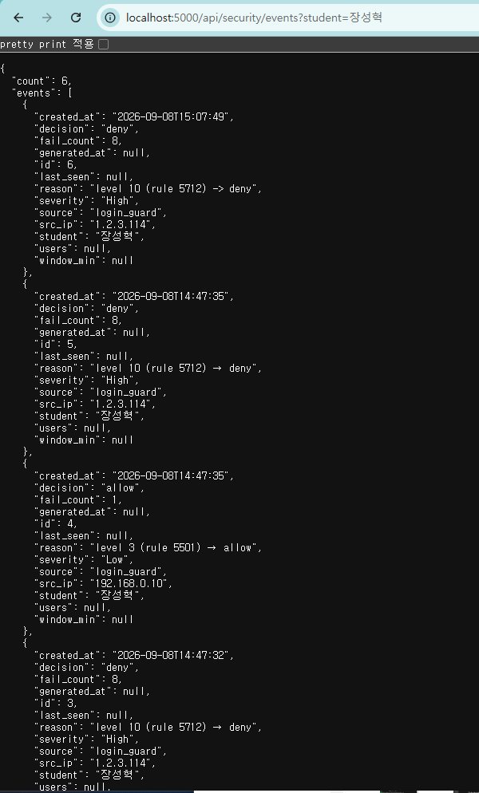

거부·허용 두 건이 모두 DB에 저장됩니다.

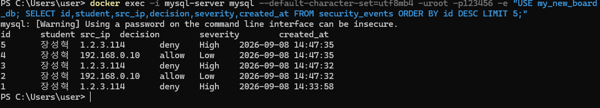

### 보안 대시보드 (웹 화면)

게시판의 `/dashboard` 화면에서 n8n이 저장한 기록을 바로 확인할 수 있습니다. 전체·거부·허용 건수와 최다 거부 IP를 요약하고, 학생 필터와 거부/허용 탭으로 최근 이벤트를 훑어볼 수 있습니다. 데이터는 `GET /api/security/events` 와 `GET /api/security/events/summary` 를 호출해 채웁니다.

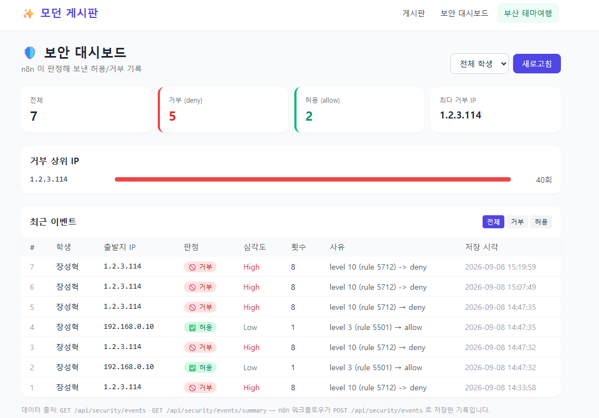

---

## 3. 실행 방법

### 준비물

- Docker Desktop (n8n, MySQL 컨테이너 실행 중)
- Python 3.x
- 본인 계정의 슬랙 Webhook URL · 디스코드 Webhook URL · 텔레그램 봇 토큰과 chat_id

### 1단계 — 게시판 서버 켜기

```bash
cd board
cp .env.example .env      # 값을 본인 환경에 맞게 채운다
pip install flask flask-sqlalchemy flask-jwt-extended pymysql python-dotenv requests
python app.py
```

`Running on http://127.0.0.1:5000` 이 뜨면 성공. **이 터미널은 그대로 둡니다.**

### 2단계 — n8n 워크플로 불러오기

1. n8n(`http://localhost:5678`) 접속
2. 우측 상단 `...` → **Import** → `n8n/workflow.json` 선택
3. 각 노드의 URL·토큰·API 키를 본인 값으로 채웁니다 (저장소에는 `<REDACTED>` 로 올려 두었습니다)
   - 슬랙 / 디스코드 노드: Webhook URL
   - 텔레그램 노드: 봇 토큰이 들어간 URL과 `chat_id`
   - 게시판 저장 노드: 헤더 `X-API-Key` 값 (`.env`의 `SECURITY_API_KEY`와 같아야 함)

### 3단계 — 실행

1. n8n에서 **Execute workflow** 클릭 (Webhook이 대기 상태가 됨)
2. **다른 터미널**에서:

```bash
cd python
python alert_sender.py
```

### 성공하면 이렇게 보입니다

- 터미널: `[n8n] POST http://localhost:5678/webhook-test/security-alert -> 200`
- n8n: 모든 노드 초록 체크, 메신저 노드는 `2 items`
- 슬랙·디스코드·텔레그램: 각각 2건 도착

```
🚫 [거부] 1.2.3.114 · level 10 (rule 5712) → deny · High · 장성혁
✅ [허용] 192.168.0.10 · 장성혁
```

- DB 확인:

```bash
docker exec -i mysql-server mysql --default-character-set=utf8mb4 -uroot -p<비밀번호> \
  -e "USE my_new_board_db; SELECT id,student,src_ip,decision,severity,created_at FROM security_events ORDER BY id DESC LIMIT 5;"
```

거부 1줄 + 허용 1줄이 새로 쌓여 있으면 성공입니다.

---

## 4. 막혔던 점과 해결 방법

### ① n8n Code 노드를 Python으로 선택했더니 실행이 안 됨

**증상**

```
Problem in node 'Code in Python'
Python runner unavailable: Python 3 is missing from this system
```

**원인** — 코드가 틀려서가 아니라 **실행할 파이썬 인터프리터 자체가 없기 때문**입니다. n8n 공식 Docker 이미지는 Node.js 기반(Alpine)이라 컨테이너 안에 Python 3가 설치되어 있지 않고, n8n의 Python 옵션은 Python 3가 설치된 별도 태스크 러너를 필요로 합니다. 노드 편집기 하단에도 `The Python option does not support _ syntax and helpers...` 라는 제약 안내가 표시됩니다.

**해결** — 세 가지를 검토했습니다.

1. 컨테이너에 Python 직접 설치 → 이미지를 다시 만들면 유실되어 재현성이 떨어짐
2. Python 포함 커스텀 이미지 빌드 → 실습 범위에 비해 과함
3. **n8n이 기본 지원하는 JavaScript로 작성** ← 채택

JavaScript로 옮기자 추가 설치 없이 동작했고, 경보 2건이 아이템 2개로 분리되어 각각 High/deny, Low/allow로 판정됐습니다.

### ② 메신저 3곳이 같은 Body 형식을 쓰지 않음

**증상** — 디스코드 설정을 그대로 복사했더니 디스코드는 `Cannot send an empty message`, 텔레그램은 `Bad Request: message text is empty`.

**원인** — 서비스마다 요구하는 키 이름이 다릅니다.

| 메신저 | Body |
|---|---|
| 슬랙 | `{ "text": "..." }` |
| 디스코드 | `{ "content": "..." }` |
| 텔레그램 | `{ "chat_id": "...", "text": "..." }` |

텔레그램은 복사 과정에서 `chat_id`까지 지워진 것이 원인이었습니다. `chat_id`는 봇에게 메시지를 한 번 보낸 뒤 `https://api.telegram.org/bot<토큰>/getUpdates` 에서 `"chat":{"id":...}` 로 확인했습니다.

또한 노드가 초록불이어도 메시지가 안 올 수 있습니다. 응답 본문의 `chat` 정보를 확인해 **웹훅이 다른 계정의 채널을 향하고 있었다**는 것을 알았고, 슬랙·디스코드·텔레그램을 모두 본인 계정으로 새로 발급해 교체했습니다.

### ③ n8n에서 게시판 API를 부르니 연결 거부

**증상** — `The service refused the connection - perhaps it is offline`

**원인 두 가지**

1. n8n은 컨테이너 안에 있어서 `localhost:5000`은 **컨테이너 자기 자신**을 가리킵니다. 호스트를 부르려면 `http://host.docker.internal:5000` 을 써야 합니다.
2. 게시판 서버가 돌던 터미널에 다른 명령을 입력해 서버가 종료돼 있었습니다.

**해결** — URL을 `host.docker.internal`로 바꾸고, **서버 전용 터미널과 명령 실행용 터미널을 분리**했습니다.

### ④ 문구를 만든 뒤 원본 필드가 사라짐

**원인** — Set(Edit Fields) 노드는 기본적으로 지정한 필드만 내보냅니다. 그대로 두면 `text`만 남아 뒤의 게시판 저장 노드가 쓸 `src_ip`·`decision`·`severity`가 사라집니다.

**해결** — 두 문구 노드 모두 **`Include Other Input Fields`를 켜서** 원본 필드를 함께 넘겼습니다.

---

## 5. 보안 처리

- API 키·DB 비밀번호·토큰은 **`.env`에만** 두고 코드는 환경변수로 읽습니다.

  ```python
  # config.py
  SECURITY_API_KEY = os.environ.get('SECURITY_API_KEY', '')
  ```

  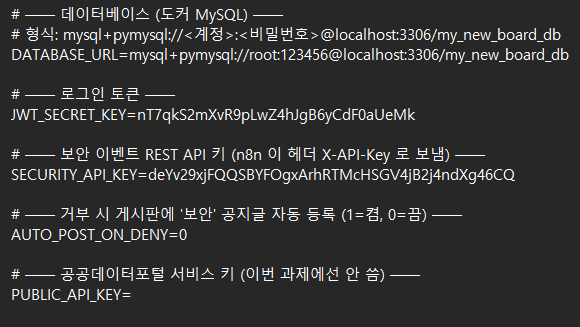

  값이 비어 있으면 POST가 항상 401이 되는 fail-closed 설계라, 실수로 키 없이 열어두는 사고를 막습니다.

- `.env`는 `.gitignore`에 등록해 업로드하지 않고, 키 이름만 있는 `.env.example`만 올렸습니다.
- `workflow.json`의 웹훅 URL·봇 토큰·API 키는 `<REDACTED>` 로 치환한 뒤 올렸습니다.

---

## 저장소 구성

```
.
├─ README.md
├─ .gitignore
├─ python/
│   └─ alert_sender.py                    # 경보 전송기
├─ n8n/
│   ├─ workflow.json                      # 워크플로 (비밀값 제거본)
│   ├─ code_node.js                       # 판정 로직
│   └─ sanitize_workflow.py               # 비밀값 제거 도구
├─ board/
│   ├─ .env.example                       # 키 이름만
│   ├─ app.py · config.py
│   ├─ models/security_event.py           # 테이블 설계도
│   ├─ controllers/security_controller.py # REST API
│   └─ api_test.py                        # 401/401/400/201 검증 스크립트
└─ images/                                # 화면 캡처
```
